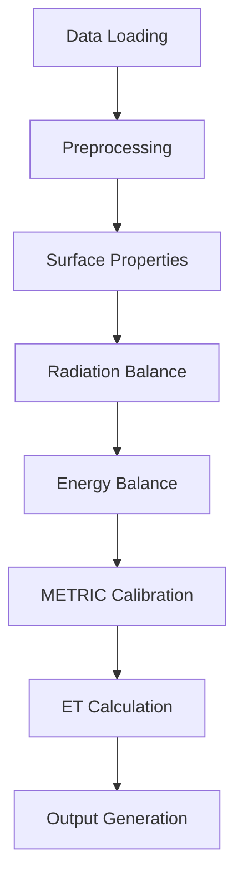
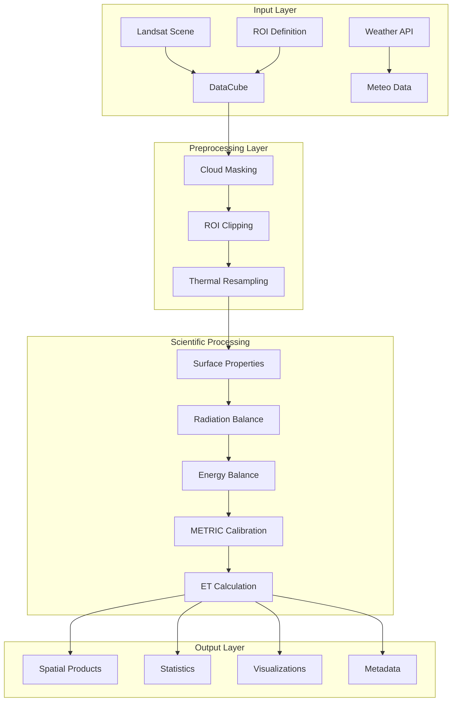

# METRIC-ET System: Comprehensive Technical Documentation

**Version:** 2.0.0  
**Date:** December 25, 2025  
**System:** METRIC-ET (Mapping Evapotranspiration with a Residual-Based Calibration)  
**Documentation Type:** Complete System Reference  

---

## Table of Contents

1. [Introduction](#1-introduction)
2. [Workflow](#2-workflow)
3. [Structure](#3-structure)
4. [Input Variables](#4-input-variables)
5. [Output Variables](#5-output-variables)
6. [Additional Details](#6-additional-details)
7. [Recent Developments](#7-recent-developments)
8. [Appendices](#8-appendices)

---

## 1. Introduction

### 1.1 System Overview

METRIC-ET is a sophisticated Python-based implementation of the METRIC (Mapping Evapotranspiration with a Residual-Based Calibration) model designed for high-resolution evapotranspiration (ET) estimation from Landsat satellite imagery. The system processes thermal infrared data and meteorological inputs to produce 30-meter resolution instantaneous and daily ET estimates using a comprehensive surface energy balance approach.

The implementation represents a significant advancement in remote sensing-based ET estimation, combining the theoretical rigor of the original METRIC model with modern software engineering practices, automated data processing capabilities, and enhanced visualization tools.

### 1.2 Scientific Foundation

METRIC-ET is built upon the fundamental surface energy balance equation:

```
Rn - G = H + LE
```

Where:
- **Rn** = Net radiation (W/m²) - Total available energy at the surface
- **G** = Soil heat flux (W/m²) - Energy conducted into the soil
- **H** = Sensible heat flux (W/m²) - Energy heating the atmosphere through convection
- **LE** = Latent heat flux (W/m²) - Energy used for evapotranspiration

The system solves for latent heat flux (LE) as the residual of the energy balance and converts it to evapotranspiration using:

```
ET = LE / λ
```

Where λ (latent heat of vaporization) ≈ 2.45 MJ/kg.

### 1.3 Purpose and Applications

The METRIC-ET system serves multiple critical applications in water resource management and agricultural monitoring:

#### Agricultural Applications
- **Irrigation Scheduling**: Precise water application timing and amounts based on actual crop ET
- **Crop Water Stress Monitoring**: Early detection of water stress for improved crop management
- **Yield Prediction**: ET integration into crop growth models for yield forecasting
- **Irrigation Efficiency Assessment**: Evaluation of irrigation system performance

#### Water Resource Management
- **Water Balance Studies**: Regional water resource assessment and planning
- **Groundwater Recharge Estimation**: ET data for groundwater model calibration
- **Reservoir Operation**: ET inputs for water supply planning
- **Drought Monitoring**: Vegetation water stress and drought condition assessment

#### Environmental Applications
- **Climate Change Studies**: Long-term ET trends for climate impact assessment
- **Ecosystem Monitoring**: Natural vegetation water use patterns
- **Wetland Management**: ET estimation for wetland conservation
- **Carbon Flux Studies**: ET correlation with carbon sequestration

### 1.4 Key Features and Capabilities

#### Core Technical Features
- **High-Resolution Processing**: 30m spatial resolution from Landsat 8/9 data
- **Automated Calibration**: Intelligent hot/cold pixel selection using the Triangle method
- **Complete Energy Balance**: Full computation of Rn, G, H, and LE components
- **Multi-Temporal Analysis**: Time series processing capabilities for temporal analysis
- **Flexible Configuration**: Comprehensive YAML-based configuration system (280+ parameters)

#### Data Processing Capabilities
- **Dynamic Weather Integration**: Automated meteorological data fetching from Open-Meteo API with spatial interpolation
- **Cloud Masking**: Advanced cloud detection and masking using Landsat QA bands
- **ROI Processing**: Flexible region-of-interest definition using GeoJSON boundaries
- **Multi-Scene Processing**: Batch processing capabilities for time series analysis
- **Quality Assessment**: Built-in validation and quality control flags

#### Output and Visualization
- **Multiple Formats**: GeoTIFF, NetCDF, CSV, and JSON output formats
- **Comprehensive Visualization**: Spatial maps, time series plots, histograms, and energy balance diagrams
- **Statistical Analysis**: Automated statistics computation and reporting
- **Metadata Generation**: Detailed processing metadata for reproducibility

#### Software Architecture
- **Modular Design**: Object-oriented architecture with separable components
- **Extensive Logging**: Comprehensive logging and error handling
- **Memory Optimization**: Efficient memory management for large datasets
- **Parallel Processing**: Support for multi-threaded processing (configurable)

### 1.5 System Evolution and Current State

The METRIC-ET system has evolved through multiple development phases, with significant recent improvements:

#### Recent Major Enhancements (2025)
- **Dynamic Weather Fetching**: Complete implementation of automated weather data retrieval
- **Enhanced Visualization**: Comprehensive plotting and mapping capabilities
- **Improved Error Handling**: Robust error recovery and user-friendly error messages
- **Configuration Simplification**: Streamlined configuration with sensible defaults
- **Quality Control**: Enhanced validation and quality assessment tools

#### Current Capabilities
- **Automated Processing**: End-to-end processing with minimal manual intervention
- **Spatial Weather Variation**: Representation of spatial meteorological variability
- **Advanced Calibration**: Multiple calibration methods and quality assessment
- **Comprehensive Outputs**: Full suite of ET products and diagnostic information

---

## 2. Workflow

### 2.1 High-Level Process Flow

The METRIC-ET workflow follows a structured, sequential pipeline with seven major processing stages:



### 2.2 Detailed Processing Workflow

#### Stage 1: Data Loading and Preprocessing

**Input Requirements:**
- Landsat Collection 2 Level-2 scene directory
- Meteorological data (automatically fetched or manually provided)
- Region of Interest (ROI) definition (GeoJSON format)
- Optional Digital Elevation Model (DEM)

**Processing Steps:**
1. **Scene Validation**
   - Verify Landsat data format and completeness
   - Check for required bands (blue, green, red, NIR, SWIR1, SWIR2, thermal, QA)
   - Validate metadata (MTL.json) and acquisition time
   - Assess cloud cover percentage

2. **ROI Clipping**
   - Load GeoJSON ROI boundary
   - Transform coordinates to match Landsat CRS
   - Clip all bands to ROI extent
   - Update spatial reference information

3. **Cloud Masking**
   - Parse Landsat QA bands (QA and QA_pixel)
   - Apply cloud and cloud shadow masks
   - Implement dilation buffer around cloud edges
   - Create quality mask for downstream processing

4. **Thermal Resampling**
   - Resample thermal band from 100m to 30m resolution
   - Use bilinear interpolation for temperature data
   - Preserve thermal characteristics during resampling

**Output:** Preprocessed DataCube with all input bands, quality masks, and metadata

#### Stage 2: Surface Property Calculation

**Input:** Preprocessed Landsat bands and metadata

**Processing Steps:**
1. **Vegetation Index Calculation**
   - Compute Normalized Difference Vegetation Index (NDVI)
   - Apply quality filters and physical bounds checking
   - Calculate vegetation fraction based on NDVI thresholds

2. **Surface Albedo Calculation**
   - Apply broadband albedo calculation (Tasumi or Liang method)
   - Weight Landsat reflective bands according to solar spectrum
   - Apply atmospheric and terrain corrections

3. **Surface Emissivity Estimation**
   - Calculate emissivity based on NDVI and land cover type
   - Apply empirical relationships for different surface types
   - Handle special cases (water, urban, bare soil)

4. **Surface Roughness Calculation**
   - Estimate roughness length (z₀ₘ) from vegetation parameters
   - Calculate displacement height using vegetation height
   - Apply land cover-specific roughness relationships

**Output:** Surface properties including NDVI, albedo, emissivity, and roughness length

#### Stage 3: Radiation Balance Calculation

**Input:** Surface properties, meteorological data, solar geometry

**Processing Steps:**
1. **Shortwave Radiation Components**
   - Calculate incoming shortwave radiation (Rs↓) from meteorological data
   - Compute surface-reflected shortwave radiation using albedo
   - Apply terrain shading corrections if DEM available
   - Calculate net shortwave radiation (Rns = Rs↓ - Rs↑)

2. **Longwave Radiation Components**
   - Calculate surface longwave emission using emissivity and temperature
   - Compute atmospheric longwave radiation from meteorological data
   - Apply atmospheric transmittance corrections
   - Calculate net longwave radiation (Rnl = L↓ - L↑)

3. **Net Radiation Calculation**
   - Combine shortwave and longwave components: Rn = Rns - Rnl
   - Apply physical constraints (minimum values, negative value handling)
   - Calculate available energy for evapotranspiration

**Output:** Complete radiation balance components (Rn, Rns, Rnl, Rs↓, Rs↑, L↓, L↑)

#### Stage 4: Energy Balance Calculation

**Input:** Net radiation, surface properties, meteorological data

**Processing Steps:**
1. **Soil Heat Flux (G) Estimation**
   - Apply empirical G/Rn relationships (Kustas or Bastiaanssen methods)
   - Consider vegetation cover and surface moisture conditions
   - Apply temperature and time-of-day corrections

2. **Initial Sensible Heat Flux (H) Calculation**
   - Calculate aerodynamic resistance using similarity theory
   - Apply Monin-Obukhov stability corrections
   - Estimate temperature difference (dT) using bulk formulas
   - Calculate initial H using dT and aerodynamic resistance

3. **Initial Latent Heat Flux (LE)**
   - Compute LE as energy balance residual: LE = Rn - G - H
   - Apply physical constraints and quality checks
   - Assess energy balance closure

**Output:** Initial energy balance components (G, H, LE) with quality metrics

#### Stage 5: METRIC Calibration

**Input:** Surface temperature, NDVI, albedo, meteorological data, initial energy balance

**Processing Steps:**
1. **Anchor Pixel Selection**
   - Apply Triangle method for hot/dry and cold/wet pixel identification
   - Select cold pixels from well-watered vegetation (high NDVI, low temperature)
   - Select hot pixels from dry bare soil (low NDVI, high temperature)
   - Validate anchor pixel selection quality

2. **Reference ET Fraction Assignment**
   - Assign expected ETrF values to anchor pixels
   - Cold pixel: ETrF ≈ 1.05 (well-watered conditions)
   - Hot pixel: ETrF ≈ 0.05 (water-stressed conditions)
   - Apply land cover and vegetation-specific adjustments

3. **dT-Ts Relationship Calibration**
   - Extract surface temperatures (Ts) for anchor pixels
   - Calculate expected dT values from reference ET fractions
   - Perform linear regression: dT = a × Ts + b
   - Validate calibration quality and physical reasonableness

4. **Calibration Application**
   - Apply calibrated coefficients to entire scene
   - Update sensible heat flux calculations
   - Recalculate latent heat flux with calibrated parameters
   - Assess final energy balance closure

**Output:** Calibrated dT coefficients (a, b), validated anchor pixels, and updated energy balance

#### Stage 6: ET Calculation

**Input:** Calibrated energy balance, meteorological data, reference ET

**Processing Steps:**
1. **Instantaneous ET Calculation**
   - Calculate instantaneous ET rate: ET_inst = LE / λ
   - Apply temperature-dependent latent heat of vaporization
   - Calculate reference ET fraction: ETrF = ET_inst / ETr_inst
   - Apply physical constraints and quality checks

2. **Daily ET Scaling**
   - Scale instantaneous ET to daily values using reference ET
   - Apply diurnal curve considerations if configured
   - Account for solar noon fraction and day length
   - Calculate daily ET: ET_daily = ETrF × ETr_daily

3. **Quality Assessment**
   - Evaluate ET values against physical constraints
   - Assess calibration quality and confidence
   - Generate quality flags and confidence scores
   - Validate energy balance closure

**Output:** Complete ET products (ET_inst, ET_daily, ETrF) with quality metrics

#### Stage 7: Output Generation

**Input:** All calculated products, metadata, calibration results

**Processing Steps:**
1. **Spatial Product Generation**
   - Write GeoTIFF files for all ET products
   - Apply appropriate data types and compression
   - Include spatial reference and metadata
   - Generate multi-band products if requested

2. **Statistical Analysis**
   - Calculate summary statistics for all products
   - Generate quality assessment metrics
   - Create time series summaries for multi-scene processing
   - Export statistics to CSV format

3. **Visualization Creation**
   - Generate spatial maps for ET products
   - Create time series plots for temporal analysis
   - Plot energy balance component distributions
   - Produce RGB composites and quality masks

4. **Metadata Documentation**
   - Create comprehensive processing metadata JSON
   - Document input files and processing parameters
   - Include calibration results and quality metrics
   - Generate processing summary reports

**Output:** Complete set of output files including spatial products, statistics, visualizations, and metadata

### 2.3 Decision Points and Control Flow

#### Cloud Cover Assessment
- **Threshold Check**: Scenes with cloud cover > configured threshold are automatically skipped
- **Partial Processing**: Scenes with moderate cloud cover are processed with cloud masking
- **Quality Flagging**: Cloud-affected pixels are flagged in quality masks

#### Calibration Validation
- **Anchor Pixel Quality**: Failed anchor pixel selection triggers alternative methods
- **Coefficient Validation**: Calibration coefficients are checked for physical reasonableness
- **Fallback Mechanisms**: Failed calibration uses default coefficients with warnings

#### Quality Control Checks
- **Energy Balance Closure**: Results with poor energy balance closure are flagged
- **Physical Constraints**: ET values outside expected ranges are masked or flagged
- **Calibration Confidence**: Low-confidence calibrations are documented and flagged

#### Time Series Processing
- **Scene Sequencing**: Multiple scenes are processed in chronological order
- **Temporal Consistency**: Results are checked for temporal consistency and outliers
- **Batch Processing**: Automated processing of multiple scenes with progress tracking

### 2.4 Integration Points

#### Open-Meteo API Integration
- **Automatic Weather Fetching**: Dynamic retrieval of meteorological data
- **Spatial Interpolation**: Bilinear interpolation from weather grid points
- **Time Synchronization**: Precise temporal matching with Landsat overpass
- **Error Handling**: Graceful handling of API failures and missing data

#### Landsat Data Integration
- **Direct Processing**: Processing of Collection 2 Level-2 products
- **Metadata Extraction**: Automated extraction of acquisition and calibration data
- **Quality Assessment**: Integration of Landsat QA bands for cloud and quality masking

#### ROI and Coordinate Systems
- **Flexible ROI Definition**: Support for GeoJSON, shapefile, and coordinate-based ROIs
- **Coordinate Transformation**: Automatic handling of different coordinate reference systems
- **Extent Management**: Efficient handling of ROI clipping and extent management

---

## 3. Structure

### 3.1 Architectural Overview

METRIC-ET follows a modular, object-oriented architecture designed for maintainability, extensibility, and scientific rigor. The system is organized into hierarchical modules with clear separation of concerns and well-defined interfaces.

```
metric_et/
├── core/                    # Core data structures and base classes
├── io/                     # Input/output handling and data access
├── preprocess/             # Data preprocessing and quality control
├── surface/                # Surface property calculations
├── radiation/              # Radiation balance components
├── energy_balance/         # Energy balance calculations
├── calibration/            # METRIC calibration algorithms
├── et/                     # Evapotranspiration calculations
├── output/                 # Output generation and visualization
├── pipeline/               # Main processing pipeline orchestration
├── config/                 # Configuration management
├── utils/                  # Utility functions and helpers
└── tests/                  # Unit and integration tests
```

### 3.2 Core Components

#### 3.2.1 Data Management Layer

**DataCube Class (`core/datacube.py`)**
- **Purpose**: Central data container for all raster and scalar variables
- **Implementation**: Uses xarray DataArrays for multi-dimensional labeled arrays
- **Features**:
  - Automatic coordinate and CRS management
  - Type-safe data addition and retrieval
  - Metadata storage and propagation
  - Spatial indexing and subsetting
  - Memory-efficient data access

**Key Methods:**
```python
class DataCube:
    def add(self, name: str, data: xr.DataArray) -> None
    def get(self, name: str) -> Optional[xr.DataArray]
    def subset(self, bounds: Tuple[float, float, float, float]) -> 'DataCube'
    def to_geotiff(self, filename: str, bands: List[str]) -> None
```

#### 3.2.2 Processing Pipeline Layer

**METRICPipeline Class (`pipeline/metric_pipeline.py`)**
- **Purpose**: Main orchestration class implementing the complete METRIC workflow
- **Implementation**: Sequential processing with error handling and progress tracking
- **Features**:
  - Modular step-by-step processing
  - Comprehensive error handling and recovery
  - Progress monitoring and logging
  - Configuration-driven processing
  - Memory management for large datasets

**Key Methods:**
```python
class METRICPipeline:
    def run(self, landsat_dir: str, meteo_data: Dict, output_dir: str) -> Dict
    def _load_data(self) -> DataCube
    def _preprocess(self, cube: DataCube) -> DataCube
    def _calculate_surface_properties(self, cube: DataCube) -> DataCube
    def _calculate_radiation_balance(self, cube: DataCube) -> DataCube
    def _calculate_energy_balance(self, cube: DataCube) -> DataCube
    def _calibrate(self, cube: DataCube) -> CalibrationResult
    def _calculate_et(self, cube: DataCube, calibration: CalibrationResult) -> DataCube
    def _generate_outputs(self, cube: DataCube, calibration: CalibrationResult) -> Dict
```

#### 3.2.3 Input/Output Layer

**Data Reading Components**

| Component | File | Responsibility | Key Features |
|-----------|------|----------------|--------------|
| LandsatReader | `io/landsat_reader.py` | Landsat data loading | Band validation, metadata extraction, CRS handling |
| MeteoReader | `io/meteo_reader.py` | Weather data loading | Time interpolation, spatial handling |
| DynamicWeatherFetcher | `io/dynamic_weather_fetcher.py` | API weather fetching | Open-Meteo integration, spatial interpolation |

**Data Writing Components**

| Component | File | Responsibility | Key Features |
|-----------|------|----------------|--------------|
| OutputWriter | `output/writer.py` | Output file generation | Multi-format support, metadata inclusion |
| Visualization | `output/visualization.py` | Plot and map generation | Comprehensive plotting, customizable outputs |

#### 3.2.4 Scientific Calculation Layer

**Surface Properties Module (`surface/`)**
- **VegetationIndices**: NDVI, EVI, and other vegetation indices
- **AlbedoCalculator**: Broadband albedo calculation using multiple methods
- **EmissivityCalculator**: Surface emissivity estimation from NDVI and land cover
- **RoughnessCalculator**: Surface roughness length estimation

**Radiation Balance Module (`radiation/`)**
- **NetRadiation**: Complete net radiation calculation
- **ShortwaveRadiation**: Incoming and reflected shortwave components
- **LongwaveRadiation**: Longwave radiation components with atmospheric corrections

**Energy Balance Module (`energy_balance/`)**
- **EnergyBalanceManager**: Orchestrates energy balance calculations
- **SoilHeatFlux**: Soil heat flux estimation using empirical relationships
- **SensibleHeatFlux**: Sensible heat flux with stability corrections
- **LatentHeatFlux**: Latent heat flux calculation and constraints

#### 3.2.5 Calibration System

**METRIC Calibration Module (`calibration/`)**
- **AnchorPixelSelector**: Intelligent hot/cold pixel selection using Triangle method
- **DTCalibration**: Linear regression calibration of dT-Ts relationship
- **CalibrationResult**: Structured results with quality metrics and validation

### 3.3 Data Flow Architecture

The METRIC-ET system implements a sophisticated data flow architecture that ensures data integrity, computational efficiency, and scientific accuracy:



### 3.4 Configuration Management

#### Hierarchical Configuration System

The system implements a hierarchical configuration management system with multiple levels:

1. **Default Configuration**: Built-in sensible defaults for all parameters
2. **Configuration File**: User-provided YAML configuration file
3. **Runtime Parameters**: Command-line or programmatic parameter overrides
4. **Environment Variables**: System-level configuration through environment

#### Configuration Categories

| Category | Parameters | Description |
|----------|------------|-------------|
| Input/Output | 15+ | File paths, formats, naming conventions |
| Preprocessing | 20+ | Cloud masking, resampling, quality control |
| Calibration | 25+ | Anchor pixel selection, ETrF targets, methods |
| Weather | 10+ | Data sources, interpolation, time matching |
| Surface Properties | 30+ | Albedo methods, vegetation indices, emissivity |
| Radiation | 25+ | Shortwave/longwave calculations, corrections |
| Energy Balance | 35+ | G/H/LE calculations, stability corrections |
| ET Calculation | 20+ | Latent heat, scaling, constraints |
| Output | 20+ | Formats, compression, visualization settings |
| System | 15+ | Memory, logging, parallel processing |

#### Configuration Validation

The system implements comprehensive configuration validation:
- **Type Checking**: Parameter type validation
- **Range Validation**: Physical bounds checking
- **Dependency Validation**: Inter-parameter relationship validation
- **Compatibility Check**: Version and dependency compatibility

### 3.5 Dependencies and Technologies

#### Core Scientific Libraries
- **NumPy**: Numerical computations and array operations (v1.21+)
- **xarray**: Multi-dimensional labeled arrays and datasets (v0.20+)
- **SciPy**: Scientific computing functions and interpolation (v1.7+)
- **pandas**: Data manipulation and analysis (v1.3+)

#### Geospatial Libraries
- **rasterio**: Geospatial raster data handling (v1.3+)
- **geopandas**: Vector data manipulation and spatial operations (v0.10+)
- **shapely**: Geometric object manipulation (v1.8+)
- **pyproj**: Coordinate transformation operations (v3.2+)

#### Visualization Libraries
- **matplotlib**: Comprehensive plotting and visualization (v3.5+)
- **seaborn**: Statistical data visualization (v0.11+)
- **cartopy**: Geospatial visualization and mapping (v0.20+)

#### External Services
- **Open-Meteo API**: Historical meteorological data (v1.0)
- **USGS Landsat**: Satellite imagery data source

#### System Libraries
- **loguru**: Structured logging and error handling (v0.6+)
- **pyyaml**: Configuration file parsing (v6.0+)
- **requests**: HTTP client for API interactions (v2.28+)
- **tqdm**: Progress bar and monitoring (v22.0+)

#### Development and Testing
- **pytest**: Testing framework (v7.0+)
- **pytest-cov**: Coverage reporting (v4.0+)
- **black**: Code formatting (v22.0+)
- **flake8**: Code linting (v5.0+)

### 3.6 Memory Management and Performance

#### Memory Optimization Strategies
- **Lazy Loading**: Data loaded only when needed
- **Chunked Processing**: Large arrays processed in memory-efficient chunks
- **Garbage Collection**: Explicit memory cleanup after processing stages
- **Data Type Optimization**: Efficient data types for storage and computation

#### Performance Optimization
- **Vectorized Operations**: NumPy vectorized computations throughout
- **Parallel Processing**: Multi-threaded processing for independent operations
- **Caching**: Intermediate results cached to avoid recomputation
- **I/O Optimization**: Efficient reading and writing with appropriate buffering

#### Scalability Considerations
- **Large Area Processing**: Optimized for processing areas up to 1000 km²
- **Multi-Scene Processing**: Efficient handling of time series datasets
- **Resource Monitoring**: Memory and CPU usage monitoring and reporting
- **Graceful Degradation**: Reduced functionality for memory-constrained environments

---

## 4. Input Variables

### 4.1 Landsat Satellite Data

#### 4.1.1 Required Spectral Bands

METRIC-ET requires Landsat Collection 2 Level-2 surface reflectance and surface temperature products. The system supports both Landsat 8 OLI/TIRS and Landsat 9 OLI-2/TIRS-2 data.

| Band Name | Filename | Sensor Band | Wavelength (μm) | Resolution | Data Type | Units | Scaling Factor | Offset |
|-----------|----------|-------------|-----------------|------------|-----------|-------|----------------|--------|
| Coastal/Aerosol | `blue.tif` | Band 1 | 0.43-0.45 | 30m | UInt16 | Reflectance | 0.000275 | -0.2 |
| Blue | `blue.tif` | Band 2 | 0.45-0.52 | 30m | UInt16 | Reflectance | 0.000275 | -0.2 |
| Green | `green.tif` | Band 3 | 0.52-0.60 | 30m | UInt16 | Reflectance | 0.000275 | -0.2 |
| Red | `red.tif` | Band 4 | 0.63-0.67 | 30m | UInt16 | Reflectance | 0.000275 | -0.2 |
| NIR | `nir08.tif` | Band 5 | 0.85-0.88 | 30m | UInt16 | Reflectance | 0.000275 | -0.2 |
| SWIR-1 | `swir16.tif` | Band 6 | 1.57-1.65 | 30m | UInt16 | Reflectance | 0.000275 | -0.2 |
| SWIR-2 | `swir22.tif` | Band 7 | 2.11-2.29 | 30m | UInt16 | Reflectance | 0.000275 | -0.2 |
| Thermal | `lwir11.tif` | Band 10/11 | 10.60-12.51 | 100m | UInt16 | Kelvin | 0.0001 | 0 |
| QA Band | `qa.tif` | QA | - | 30m | UInt16 | Quality | Bit flags | - |
| QA Pixel | `qa_pixel.tif` | QA Pixel | - | 30m | UInt16 | Quality | Bit flags | - |

#### 4.1.2 Data Quality Requirements

**Atmospheric Correction**: All reflective bands must be Level-2 atmospherically corrected surface reflectance products.

**Geometric Accuracy**: Data must be geometrically corrected with sub-pixel accuracy.

**Cloud Cover**: Scenes with >30% cloud cover are typically excluded, though this threshold is configurable.

**Data Completeness**: All required bands must be present and valid for successful processing.

#### 4.1.3 Metadata Requirements

**MTL.json File**: Contains critical metadata including:
- Acquisition date and time
- Solar geometry (elevation, azimuth)
- Scene center coordinates
- Processing parameters
- Sensor calibration information

**Coordinate Reference System**: Data must be in a projected coordinate system (typically UTM zones).

**Spatial Extent**: Data should cover the complete region of interest plus a buffer for processing.

### 4.2 Meteorological Data

#### 4.2.1 Automated Weather Data Fetching

The system includes automatic weather data fetching from the Open-Meteo Archive API, which provides:

**Data Source**: ERA5 reanalysis data from European Centre for Medium-Range Weather Forecasts (ECMWF)

**Temporal Resolution**: Hourly data interpolated to Landsat overpass time (10:30 local time)

**Spatial Resolution**: 0.1° (~11km) resolution with bilinear interpolation to Landsat pixels

**Data Coverage**: Global coverage with historical data back to 1940

#### 4.2.2 Required Meteorological Variables

| Variable | Symbol | Units | Height | Description | Data Type | Range |
|----------|--------|-------|--------|-------------|-----------|-------|
| Air Temperature | Ta | °C | 2m | Air temperature at 2m height | Float32 | -50 to 60°C |
| Relative Humidity | RH | % | 2m | Relative humidity at 2m height | Float32 | 0 to 100% |
| Wind Speed | u | m/s | 10m | Wind speed at 10m height | Float32 | 0 to 50 m/s |
| Surface Pressure | P | hPa | Surface | Atmospheric surface pressure | Float32 | 800 to 1200 hPa |
| Shortwave Radiation | Rs↓ | W/m² | Surface | Incoming solar shortwave radiation | Float32 | 0 to 1400 W/m² |
| Reference ET | ETr/ET₀ | mm/day | - | FAO-56 reference evapotranspiration | Float32 | 0 to 15 mm/day |

#### 4.2.3 Weather Data Validation

**Temporal Matching**: Weather data must be within ±30 minutes of Landsat overpass time

**Physical Constraints**: All meteorological variables validated against physical ranges

**Quality Flags**: Open-Meteo quality flags used to identify potentially problematic data

**Interpolation**: Bilinear spatial interpolation from weather grid points to Landsat pixel centers

#### 4.2.4 Manual Weather Data Input

For applications requiring manual weather data input, the system accepts CSV files with the following format:

```csv
timestamp,temperature_2m,relative_humidity_2m,wind_speed_10m,surface_pressure,shortwave_radiation,et0_fao_evapotranspiration
2025-10-17T10:30:00,25.3,45.2,3.1,1013.2,650.4,4.2
```

### 4.3 Region of Interest (ROI)

#### 4.3.1 ROI Definition Methods

**GeoJSON Format**: Primary method for ROI definition with polygon geometry

**Coordinate Lists**: Direct specification of bounding box coordinates

**Shapefile Support**: Import from ESRI shapefile format (requires geopandas)

**Interactive Definition**: Programmatic ROI definition using coordinate arrays

#### 4.3.2 ROI Requirements

**Coordinate System**: ROI coordinates should be in WGS84 (EPSG:4326) or match Landsat CRS

**Geometry Type**: Support for polygons, multipolygons, and complex geometries

**File Size**: ROI files should be <10MB for optimal performance

**Validation**: Automatic validation of geometry validity and coordinate ranges

#### 4.3.3 Default ROI

The system includes a default ROI (`amirkabir.geojson`) for testing and demonstration purposes, representing an agricultural area in Iran.

### 4.4 Digital Elevation Model (Optional)

#### 4.4.1 DEM Requirements

**Format**: GeoTIFF format with embedded georeferencing

**Resolution**: 30m resolution recommended to match Landsat pixel size

**Coverage**: Must cover the complete ROI with appropriate buffer

**Data Type**: 16-bit or 32-bit integer/float elevation values

#### 4.4.2 DEM-Derived Variables

**Elevation**: Surface elevation in meters above sea level

**Slope**: Surface slope gradient in degrees or percent

**Aspect**: Surface aspect (direction of slope) in degrees from north

**Terrain Shading**: Solar shading effects from topography

#### 4.4.3 DEM Processing

**Coordinate Transformation**: Automatic reprojection to match Landsat CRS

**Resampling**: Bilinear interpolation to match Landsat resolution

**Quality Assessment**: Validation of elevation ranges and smoothness

**Terrain Correction**: Optional terrain-based radiation corrections

### 4.5 Configuration Parameters

#### 4.5.1 Processing Configuration

**Cloud Masking Parameters**:
- `cloud_threshold`: Maximum cloud cover percentage (default: 30%)
- `cloud_buffer_size`: Pixel buffer around clouds (default: 3 pixels)
- `use_terrain_mask`: Apply terrain shadow masking (default: false)

**Calibration Parameters**:
- `calibration.method`: Calibration method ('auto', 'hot-cold', 'manual')
- `calibration.cold_etrf`: Expected ETrF for cold pixel (default: 1.05)
- `calibration.hot_etrf`: Expected ETrF for hot pixel (default: 0.05)
- `calibration.anchor_pixel_coords`: Manual anchor pixel coordinates (optional)

**Output Configuration**:
- `output.format`: Output format ('GeoTIFF', 'NetCDF', 'both')
- `output.compress`: Compression method ('LZW', 'deflate', 'none')
- `output.bands`: List of products to generate

#### 4.5.2 Validation Rules

**Data Completeness**: All required input data must be present and valid

**Coordinate Consistency**: All spatial data must have consistent coordinate reference systems

**Temporal Alignment**: Weather data must temporally align with Landsat acquisition

**Physical Bounds**: All input values validated against physical constraints

### 4.6 Data Quality and Validation

#### 4.6.1 Input Data Validation

**Format Validation**: Automatic detection and validation of input file formats

**Content Validation**: Verification of data content and statistical properties

**Spatial Validation**: Assessment of spatial coverage and resolution

**Temporal Validation**: Verification of temporal coverage and alignment

#### 4.6.2 Quality Flags

**Cloud Detection**: Landsat QA bands used for cloud and cloud shadow identification

**Data Quality**: Assessment of data quality based on various quality indicators

**Processing Quality**: Quality flags generated during processing stages

**Output Quality**: Final quality assessment of generated products

---

## 5. Output Variables

### 5.1 Primary Evapotranspiration Products

#### 5.1.1 Daily Evapotranspiration (ET_daily)

**Variable Name**: `ET_daily`  
**Units**: mm/day  
**Data Type**: Float32  
**Range**: 0.0 - 15.0 mm/day (typical range)  
**Resolution**: 30m (matching Landsat)  

**Description**: Daily actual evapotranspiration scaled from instantaneous ET using the reference ET fraction. This is the primary output product representing the total water loss through evapotranspiration over a 24-hour period.

**Derivation**:
```
ET_daily = ETrF × ETr_daily
```
Where:
- ETrF = Reference ET fraction (dimensionless)
- ETr_daily = Daily reference ET from meteorological data (mm/day)

**Physical Interpretation**: Values represent the depth of water that would evaporate from the surface if sufficient water were available, normalized to daily totals.

**Quality Indicators**:
- **High Quality**: 0.5 - 12.0 mm/day with good spatial variation
- **Medium Quality**: 0.2 - 15.0 mm/day with moderate spatial variation
- **Low Quality**: 0.0 - 15.0 mm/day with limited spatial variation

**Output Format**: GeoTIFF with LZW compression, NoData value: -9999.0

#### 5.1.2 Instantaneous Evapotranspiration (ET_inst)

**Variable Name**: `ET_inst`  
**Units**: mm/hour  
**Data Type**: Float32  
**Range**: 0.0 - 1.5 mm/hr (typical range)  
**Resolution**: 30m  

**Description**: Instantaneous ET rate at the time of Landsat overpass (approximately 10:30 local time). This represents the actual evapotranspiration rate at the moment of satellite observation.

**Derivation**:
```
ET_inst = LE / λ
```
Where:
- LE = Latent heat flux (W/m²)
- λ = Latent heat of vaporization (2.45 MJ/kg = 2,450,000 J/kg)

**Physical Interpretation**: Values represent the rate of water loss through evapotranspiration at the instant of satellite overpass, expressed as millimeters of water per hour.

**Quality Indicators**:
- **High Quality**: 0.1 - 1.2 mm/hr with realistic spatial patterns
- **Medium Quality**: 0.05 - 1.5 mm/hr with acceptable spatial patterns
- **Low Quality**: 0.0 - 1.5 mm/hr with limited spatial patterns

#### 5.1.3 Reference ET Fraction (ETrF)

**Variable Name**: `ETrF`  
**Units**: dimensionless  
**Data Type**: Float32  
**Range**: 0.0 - 1.5 (typical range)  
**Resolution**: 30m  

**Description**: Ratio of actual evapotranspiration to reference ET, indicating the relative water stress of the vegetation. This dimensionless parameter is crucial for irrigation scheduling and water stress assessment.

**Derivation**:
```
ETrF = ET_inst / ETr_inst
```
Where:
- ET_inst = Instantaneous actual ET (mm/hr)
- ETr_inst = Instantaneous reference ET (mm/hr)

**Physical Interpretation**:
- **ETrF ≈ 1.0**: Well-watered vegetation with no water stress
- **ETrF ≈ 0.5**: Moderate water stress, irrigation beneficial
- **ETrF ≈ 0.2**: Severe water stress, immediate irrigation required
- **ETrF < 0.1**: Extreme water stress, vegetation under severe drought stress

**Quality Indicators**:
- **High Quality**: 0.2 - 1.2 with realistic spatial patterns
- **Medium Quality**: 0.1 - 1.3 with acceptable spatial patterns
- **Low Quality**: 0.0 - 1.5 with limited spatial patterns

### 5.2 Energy Balance Components

#### 5.2.1 Latent Heat Flux (LE)

**Variable Name**: `LE`  
**Units**: W/m²  
**Data Type**: Float32  
**Range**: 0 - 600 W/m² (typical range)  
**Resolution**: 30m  

**Description**: Energy used for evapotranspiration, representing the largest component of the surface energy balance in most vegetated areas. This is the primary energy flux that drives ET calculations.

**Derivation**:
```
LE = Rn - G - H
```
Where:
- Rn = Net radiation (W/m²)
- G = Soil heat flux (W/m²)
- H = Sensible heat flux (W/m²)

**Physical Interpretation**: Positive values indicate energy consumption by evapotranspiration, while negative values (though rare) would indicate condensation or dew formation.

**Quality Indicators**:
- **High Quality**: 50 - 500 W/m² with realistic spatial patterns
- **Medium Quality**: 20 - 600 W/m² with acceptable spatial patterns
- **Low Quality**: 0 - 600 W/m² with limited spatial patterns

#### 5.2.2 Sensible Heat Flux (H)

**Variable Name**: `H`  
**Units**: W/m²  
**Data Type**: Float32  
**Range**: -200 - 400 W/m² (typical range)  
**Resolution**: 30m  

**Description**: Energy transferred to the atmosphere through convection and turbulence. This flux represents the heating of the air above the surface.

**Derivation**:
```
H = ρ × Cp × (dT / rah)
```
Where:
- ρ = Air density (kg/m³)
- Cp = Specific heat of air (1004 J/kg/K)
- dT = Temperature difference between surface and air (K)
- rah = Aerodynamic resistance (s/m)

**Physical Interpretation**: Positive values indicate heating of the atmosphere, while negative values indicate cooling (typically associated with strong evapotranspiration cooling).

**Quality Indicators**:
- **High Quality**: -100 - 300 W/m² with realistic spatial patterns
- **Medium Quality**: -200 - 400 W/m² with acceptable spatial patterns
- **Low Quality**: -200 - 400 W/m² with limited spatial patterns

#### 5.2.3 Soil Heat Flux (G)

**Variable Name**: `G`  
**Units**: W/m²  
**Data Type**: Float32  
**Range**: -100 - 200 W/m² (typical range)  
**Resolution**: 30m  

**Description**: Energy conducted into or out of the soil. This flux is typically small during daytime hours but can be significant for bare soil or during transitional periods.

**Derivation**: Empirical relationships based on net radiation, vegetation index, and surface conditions:
```
G/Rn = f(NDVI, Ts, time_of_day)
```
Where common methods include Kustas and Bastiaanssen formulations.

**Physical Interpretation**: Positive values indicate energy flow into the soil (heating), while negative values indicate energy flow out of the soil (cooling, typically at night).

**Quality Indicators**:
- **High Quality**: -50 - 150 W/m² with realistic spatial patterns
- **Medium Quality**: -100 - 200 W/m² with acceptable spatial patterns
- **Low Quality**: -100 - 200 W/m² with limited spatial patterns

#### 5.2.4 Net Radiation (Rn)

**Variable Name**: `Rn`  
**Units**: W/m²  
**Data Type**: Float32  
**Range**: 100 - 1000 W/m² (typical daytime range)  
**Resolution**: 30m  

**Description**: Total net energy available at the surface, combining shortwave and longwave radiation components. This is the primary energy source for all surface energy exchanges.

**Derivation**:
```
Rn = Rns - Rnl = (Rs↓ - Rs↑) - (L↓ - L↑)
```
Where:
- Rns = Net shortwave radiation (W/m²)
- Rnl = Net longwave radiation (W/m²)
- Rs↓ = Incoming shortwave radiation (W/m²)
- Rs↑ = Reflected shortwave radiation (W/m²)
- L↓ = Incoming longwave radiation (W/m²)
- L↑ = Emitted longwave radiation (W/m²)

**Physical Interpretation**: Represents the total radiative energy balance, with positive values indicating net energy gain by the surface.

**Quality Indicators**:
- **High Quality**: 200 - 900 W/m² with realistic spatial patterns
- **Medium Quality**: 100 - 1000 W/m² with acceptable spatial patterns
- **Low Quality**: 0 - 1000 W/m² with limited spatial patterns

### 5.3 Surface Properties

#### 5.3.1 Normalized Difference Vegetation Index (NDVI)

**Variable Name**: `ndvi`  
**Units**: dimensionless  
**Data Type**: Float32  
**Range**: -1.0 - 1.0  
**Resolution**: 30m  

**Description**: Indicator of vegetation greenness and vigor, calculated from the red and near-infrared bands. This is a fundamental parameter for vegetation monitoring and energy balance calculations.

**Derivation**:
```
NDVI = (NIR - Red) / (NIR + Red)
```
Where:
- NIR = Near-infrared reflectance
- Red = Red band reflectance

**Physical Interpretation**:
- **NDVI > 0.7**: Dense, healthy vegetation
- **NDVI 0.4-0.7**: Moderate vegetation cover
- **NDVI 0.2-0.4**: Sparse vegetation
- **NDVI < 0.2**: Bare soil or non-vegetated areas
- **NDVI < 0**: Water bodies or snow/ice

#### 5.3.2 Surface Albedo

**Variable Name**: `albedo`  
**Units**: dimensionless  
**Data Type**: Float32  
**Range**: 0.0 - 0.9  
**Resolution**: 30m  

**Description**: Broadband surface reflectance representing the fraction of incoming solar radiation that is reflected by the surface. This parameter is crucial for radiation balance calculations.

**Derivation**: Weighted average of Landsat reflective bands using solar spectrum weighting:
```
Albedo = Σ(wi × Bi)
```
Where:
- wi = Weight for band i
- Bi = Reflectance for band i

Common methods include Tasumi and Liang formulations.

**Physical Interpretation**:
- **Albedo < 0.2**: Dark surfaces (forests, water)
- **Albedo 0.2-0.4**: Agricultural areas, grasslands
- **Albedo 0.4-0.6**: Bare soil, urban areas
- **Albedo > 0.6**: Bright surfaces (concrete, snow)

#### 5.3.3 Surface Emissivity

**Variable Name**: `emissivity`  
**Units**: dimensionless  
**Data Type**: Float32  
**Range**: 0.9 - 1.0  
**Resolution**: 30m  

**Description**: Surface thermal emissivity representing the efficiency of surface emission in the thermal infrared region. This parameter is essential for accurate longwave radiation calculations.

**Derivation**: Empirical relationships based on NDVI and land cover type:
```
Emissivity = f(NDVI, land_cover_type)
```

**Physical Interpretation**:
- **Emissivity > 0.98**: Water bodies, vegetation
- **Emissivity 0.95-0.98**: Agricultural areas, grasslands
- **Emissivity 0.90-0.95**: Bare soil, rocky surfaces
- **Emissivity < 0.90**: Urban areas, some man-made materials

### 5.4 Quality Control and Diagnostic Products

#### 5.4.1 ET Quality Classification

**Variable Name**: `quality_mask`  
**Units**: categorical  
**Data Type**: UInt8  
**Range**: 1-4 (quality classes)  
**Resolution**: 30m  

**Description**: Quality classification of ET estimates based on multiple quality indicators including energy balance closure, physical constraints, and calibration quality.

**Quality Classes**:
- **Class 1 (High)**: ET values with excellent quality, energy balance closure <10%, realistic spatial patterns
- **Class 2 (Medium)**: ET values with good quality, energy balance closure <20%, acceptable spatial patterns
- **Class 3 (Low)**: ET values with acceptable quality, energy balance closure <30%, limited spatial patterns
- **Class 4 (Poor)**: ET values with poor quality, energy balance closure >30%, unrealistic spatial patterns

**Quality Assessment Criteria**:
- Energy balance closure percentage
- Physical constraint violations
- Calibration confidence scores
- Spatial variation patterns
- Temporal consistency (for time series)

#### 5.4.2 ET Confidence Score

**Variable Name**: `ET_confidence`  
**Units**: dimensionless (0-1)  
**Data Type**: Float32  
**Range**: 0.0 - 1.0  
**Resolution**: 30m  

**Description**: Quantitative confidence score for ET estimates based on multiple quality factors. This provides a continuous measure of reliability rather than categorical classification.

**Confidence Calculation**:
```
Confidence = f(energy_balance_closure, calibration_quality, spatial_consistency, temporal_consistency)
```

**Confidence Interpretation**:
- **0.8-1.0**: Very high confidence, excellent data quality
- **0.6-0.8**: High confidence, good data quality
- **0.4-0.6**: Medium confidence, acceptable data quality
- **0.2-0.4**: Low confidence, marginal data quality
- **0.0-0.2**: Very low confidence, poor data quality

#### 5.4.3 Calibration Quality Metrics

**Anchor Pixel Information**:
- **Cold Pixel Coordinates**: Location of selected cold (wet) pixel
- **Hot Pixel Coordinates**: Location of selected hot (dry) pixel
- **Cold Pixel Ts**: Surface temperature at cold pixel (K)
- **Hot Pixel Ts**: Surface temperature at hot pixel (K)
- **Calibration Coefficients**: Linear regression coefficients (a, b) for dT-Ts relationship

**Calibration Validation**:
- **R² Value**: Coefficient of determination for calibration
- **RMSE**: Root mean square error of calibration
- **Physical Validation**: Check of coefficients against expected ranges

### 5.5 Output File Formats and Structure

#### 5.5.1 GeoTIFF Format

**File Naming Convention**: `{product}_{scene_id}_{date}.tif`

**Example**: `ET_daily_LC08_20251017.tif`

**Compression**: LZW compression enabled by default

**Data Types**:
- Float32 for continuous variables (ET, energy balance components)
- UInt8 for categorical variables (quality masks)

**NoData Values**:
- -9999.0 for Float32 products
- 0 for UInt8 products

**Georeferencing**: 
- Same CRS as input Landsat data
- Same pixel size and alignment
- Embedded coordinate reference system information

**Metadata Tags**:
- Processing timestamp
- Sensor information
- Product type
- Quality information

#### 5.5.2 NetCDF Format

**File Structure**: Multi-dimensional NetCDF with CF compliance

**Dimensions**: 
- `y`: Y coordinates (rows)
- `x`: X coordinates (columns)
- `time`: Time dimension (for time series)

**Variables**: All ET products as NetCDF variables with proper units and long names

**Attributes**: CF-compliant metadata including units, long names, standard names

**Compression**: NetCDF-4 compression enabled

#### 5.5.3 Statistical Summary (CSV)

**File Content**:
- Summary statistics for each product
- Minimum, maximum, mean, standard deviation
- Valid pixel count
- Quality assessment metrics

**File Format**: Standard CSV with headers

**Example Output**:
```csv
Product,Min,Max,Mean,Std,Count,Quality_Score
ET_daily,0.12,8.45,3.21,1.85,15234,0.85
ET_inst,0.01,0.68,0.18,0.12,15234,0.85
ETrF,0.15,1.12,0.78,0.23,15234,0.85
```

#### 5.5.4 Processing Metadata (JSON)

**Content Structure**:
```json
{
  "processing_info": {
    "timestamp": "2025-10-17T10:30:00Z",
    "software": "METRIC-ET",
    "version": "2.0.0"
  },
  "scene_info": {
    "acquisition_time": "2025-10-17T10:30:00Z",
    "sensor": "Landsat 8 OLI/TIRS",
    "scene_id": "LC08_L2SP_166038_20251017_01_T1"
  },
  "calibration": {
    "a_coefficient": 0.85,
    "b_coefficient": -15.2,
    "cold_pixel_ts": 298.5,
    "hot_pixel_ts": 325.8,
    "r_squared": 0.92
  },
  "quality_metrics": {
    "energy_balance_closure": 0.08,
    "valid_pixel_fraction": 0.85,
    "calibration_confidence": 0.88
  }
}
```

### 5.6 Visualization Products

#### 5.6.1 Spatial Maps

**ET Maps**: 
- Daily ET spatial distribution
- Instantaneous ET at overpass time
- Reference ET fraction patterns

**Energy Balance Maps**:
- Net radiation distribution
- Component contributions (G, H, LE)
- Energy balance closure visualization

**Surface Property Maps**:
- NDVI distribution
- Surface temperature patterns
- Albedo and emissivity maps

#### 5.6.2 Time Series Plots

**ET Time Series**:
- Temporal evolution of ET for selected locations
- Seasonal patterns and trends
- Comparison with reference ET

**Quality Metrics**:
- Calibration quality over time
- Energy balance closure trends
- Data availability patterns

#### 5.6.3 Statistical Plots

**Distribution Histograms**:
- ET value distributions
- Energy balance component distributions
- Quality score distributions

**Scatter Plots**:
- ET vs. NDVI relationships
- Energy balance closure assessments
- Calibration quality visualizations

**Summary Figures**:
- Multi-panel summary plots
- RGB composites with ET overlays
- Quality assessment summaries

---

## 6. Additional Details

### 6.1 Assumptions and Limitations

#### 6.1.1 Physical Assumptions

**Energy Balance Closure**: The system assumes that the surface energy balance equation (Rn - G = H + LE) holds at the instantaneous time scale. This assumption is generally valid for homogeneous surfaces but may have limitations for heterogeneous landscapes.

**Reference ET Accuracy**: The system relies on FAO-56 Penman-Monteith reference ET calculations, assuming these provide accurate estimates of atmospheric demand under well-watered conditions.

**Anchor Pixel Assumptions**: 
- Cold pixels are assumed to have ETrF ≈ 1.05, representing well-watered vegetation
- Hot pixels are assumed to have ETrF ≈ 0.05, representing severely water-stressed conditions
- These assumptions may vary by climate and vegetation type

**Atmospheric Stability**: The system assumes near-neutral atmospheric conditions for aerodynamic resistance calculations, which may not always be valid during strongly stable or unstable conditions.

**Constant Latent Heat**: The latent heat of vaporization is assumed constant at 2.45 MJ/kg, though it varies slightly with temperature.

#### 6.1.2 Data Quality Assumptions

**Landsat Data Quality**: The system assumes Landsat Collection 2 Level-2 products are properly atmospherically corrected and geometrically accurate.

**Weather Data Accuracy**: Open-Meteo ERA5 reanalysis data is assumed to represent actual meteorological conditions with acceptable accuracy for ET calculations.

**Surface Homogeneity**: Each 30m pixel is assumed to represent relatively homogeneous surface conditions, which may not hold for highly heterogeneous landscapes.

**Temporal Synchronization**: The ±30-minute window for weather data matching is assumed to provide temporally representative conditions.

#### 6.1.3 Algorithm Assumptions

**Linear dT Calibration**: The temperature difference (dT) is assumed to vary linearly with surface temperature (Ts): dT = a × Ts + b.

**Empirical Relationships**: Soil heat flux and other components use empirical relationships that may not generalize to all surface types and conditions.

**Static Calibration**: Calibration coefficients are assumed valid for the entire scene, though spatial and temporal variations may exist.

#### 6.1.4 Technical Limitations

**Cloud Contamination**: The system cannot process areas with extensive cloud cover and may have residual cloud contamination in partially cloudy scenes.

**Data Availability**: Processing requires both Landsat imagery and coincident meteorological data, limiting temporal coverage.

**Spatial Resolution**: 30m resolution may not capture fine-scale heterogeneity in heterogeneous landscapes.

**Processing Extent**: Memory and computational requirements limit processing of very large areas.

### 6.2 Error Handling and Quality Control

#### 6.2.1 Input Validation

**Data Completeness Checks**:
- Verification of all required Landsat bands
- Validation of meteorological data availability
- Assessment of ROI definition validity

**Format Validation**:
- File format verification and compatibility checking
- Coordinate reference system validation
- Data type and range checking

**Quality Assessment**:
- Cloud cover assessment and threshold checking
- Data gap identification and handling
- Temporal consistency validation

#### 6.2.2 Processing Quality Control

**Calibration Quality Assessment**:
- Anchor pixel selection validation
- Calibration coefficient reasonableness checking
- Statistical quality metrics (R², RMSE)

**Energy Balance Validation**:
- Energy balance closure assessment
- Component contribution analysis
- Physical constraint violation detection

**Spatial Consistency**:
- Spatial pattern reasonableness checking
- Edge effect identification and handling
- Neighborhood consistency validation

#### 6.2.3 Error Recovery Mechanisms

**Calibration Failure Handling**:
- Fallback to default coefficients (a=0, b=0)
- Alternative calibration method attempts
- Quality flag assignment for poor calibrations

**Missing Data Handling**:
- Interpolation of small data gaps
- Masking of large data gaps
- Graceful degradation for partial failures

**Processing Error Recovery**:
- Comprehensive logging of all errors
- Intermediate result preservation
- Retry mechanisms for transient failures

#### 6.2.4 Quality Flags and Masks

**Cloud Masks**: Automated cloud and cloud shadow detection and masking using Landsat QA bands.

**Quality Classification**: Four-tier quality classification system based on multiple quality indicators.

**Confidence Scores**: Continuous confidence scores (0-1) providing quantitative reliability assessment.

**Processing Flags**: Flags indicating processing status, calibration success, and data quality issues.

### 6.3 Performance Considerations

#### 6.3.1 Computational Requirements

**Memory Requirements**:
- Minimum: 8 GB RAM for small areas (<100 km²)
- Recommended: 16 GB RAM for moderate areas (100-500 km²)
- High-end: 32+ GB RAM for large areas (>500 km²)

**Processing Time**:
- Small scenes (100×100 pixels): 2-5 minutes
- Standard scenes (185×185 km): 10-20 minutes
- Large scenes (custom): 20-60 minutes

**CPU Requirements**:
- Multi-core processor recommended (4+ cores)
- Modern instruction set support (SSE4.2/AVX2)
- Sufficient cache for large array operations

#### 6.3.2 Storage Requirements

**Input Data**: 
- Landsat scene: ~1-2 GB compressed
- Meteorological data: <1 MB per scene
- ROI files: <1 MB

**Output Data**:
- ET products (GeoTIFF): 10-50 MB per product
- All products (complete set): 100-500 MB per scene
- Visualizations: 5-20 MB per figure
- Metadata: <1 MB per scene

**Temporary Storage**:
- Intermediate processing: 1-5 GB per scene
- Log files: <100 MB per processing session

#### 6.3.3 Optimization Strategies

**Memory Management**:
- Lazy loading of input data
- Chunked processing for large arrays
- Explicit garbage collection between stages
- Memory-mapped arrays for very large datasets

**Computational Optimization**:
- Vectorized operations throughout
- Parallel processing for independent operations
- Efficient I/O with buffering
- Caching of intermediate results

**Parallel Processing**:
- Multi-threading for I/O operations
- Parallel scene processing for time series
- Parallel band processing where applicable
- Configurable parallel worker count

#### 6.3.4 Scalability Considerations

**Small Areas (<50 km²)**:
- Single-threaded processing sufficient
- Memory usage minimal
- Fast processing times

**Medium Areas (50-500 km²)**:
- Multi-threaded processing recommended
- Memory usage moderate
- Processing times acceptable

**Large Areas (>500 km²)**:
- Parallel processing essential
- Memory optimization critical
- Processing times may be significant

**Time Series Processing**:
- Batch processing capabilities
- Progress tracking and monitoring
- Efficient resource utilization

### 6.4 Installation and Configuration

#### 6.4.1 System Requirements

**Operating System**:
- Linux (Ubuntu 18.04+ recommended)
- Windows 10/11 with WSL2
- macOS 10.15+ (Intel/Apple Silicon)

**Python Environment**:
- Python 3.9 or higher
- Conda or virtual environment recommended
- 64-bit architecture required

**Dependencies**:
- NumPy, SciPy, pandas (scientific computing)
- xarray, rasterio, geopandas (geospatial)
- matplotlib, seaborn (visualization)
- pyyaml, loguru, requests (utilities)

#### 6.4.2 Installation Steps

**Using Conda**:
```bash
# Create conda environment
conda create -n metric_et python=3.9
conda activate metric_et

# Install dependencies
conda install -c conda-forge numpy scipy pandas xarray rasterio geopandas matplotlib pyyaml requests tqdm

# Install METRIC-ET
pip install metric_et
```

**Using pip**:
```bash
# Create virtual environment
python -m venv metric_et_env
source metric_et_env/bin/activate  # Linux/Mac
# metric_et_env\Scripts\activate   # Windows

# Install dependencies
pip install numpy scipy pandas xarray rasterio geopandas matplotlib pyyaml requests tqdm

# Install METRIC-ET
pip install metric_et
```

#### 6.4.3 Configuration Setup

**Configuration File**: Create `config.yaml` based on `config.example.yaml`:

```yaml
# Basic settings
input_dir: data/
output_dir: output/
date_range:
  start: 2025-09-15
  end: 2025-12-04

# Processing parameters
cloud_threshold: 30
calibration:
  method: hot-cold
  cold_etrf: 1.05
  hot_etrf: 0.05

# Weather settings
weather_source: api  # or 'csv' or 'manual'
```

**Environment Setup**:
- Ensure input data directory structure
- Create output directory
- Verify file permissions
- Test basic functionality

#### 6.4.4 Validation and Testing

**Installation Verification**:
```bash
# Test import
python -c "import metric_et; print('METRIC-ET installed successfully')"

# Test basic functionality
python -m metric_et.test_basic
```

**Configuration Validation**:
```bash
# Validate configuration file
python -c "from metric_et.config import validate_config; validate_config('config.yaml')"
```

**Sample Processing Test**:
```bash
# Process sample data
python Calculate_et.py --config config.yaml --input data/sample_scene/
```

### 6.5 Usage Examples

#### 6.5.1 Basic Single Scene Processing

```python
from metric_et.pipeline import METRICPipeline

# Initialize pipeline
pipeline = METRICPipeline(config='config.yaml')

# Process single scene
results = pipeline.run(
    landsat_dir='data/landsat_20251017_166_038/',
    meteo_data={},  # Auto-fetched from API
    output_dir='output/single_scene/'
)

# Access results
et_daily = results['ET_daily']
etrf = results['ETrF']
print(f"Mean daily ET: {et_daily.mean().values:.2f} mm/day")
```

#### 6.5.2 Batch Processing Multiple Scenes

```python
import os
import glob
from metric_et.pipeline import METRICPipeline

# Initialize pipeline
pipeline = METRICPipeline(config='config.yaml')

# Find all Landsat scenes
scene_dirs = glob.glob('data/landsat_*')

# Process each scene
for scene_dir in scene_dirs:
    scene_name = os.path.basename(scene_dir)
    output_dir = f'output/batch/{scene_name}/'
    
    try:
        results = pipeline.run(
            landsat_dir=scene_dir,
            meteo_data={},
            output_dir=output_dir
        )
        print(f"✓ Processed {scene_name}")
    except Exception as e:
        print(f"✗ Failed to process {scene_name}: {e}")
```

#### 6.5.3 Custom Configuration

```python
from metric_et.pipeline import METRICPipeline

# Custom configuration
config = {
    'calibration': {
        'method': 'hot-cold',
        'cold_etrf': 1.05,
        'hot_etrf': 0.05
    },
    'cloud_threshold': 20,
    'output': {
        'format': 'both',  # GeoTIFF and NetCDF
        'bands': ['ET_daily', 'ETrF', 'LE']
    },
    'visualization': {
        'enabled': True,
        'dpi': 300,
        'save_plots': True
    }
}

# Process with custom config
pipeline = METRICPipeline(config=config)
results = pipeline.run(
    landsat_dir='data/landsat_20251017_166_038/',
    meteo_data={},
    output_dir='output/custom/'
)
```

#### 6.5.4 Time Series Analysis

```python
import pandas as pd
import matplotlib.pyplot as plt
from metric_et.pipeline import METRICPipeline

# Process multiple scenes and collect statistics
results_df = []
pipeline = METRICPipeline(config='config.yaml')

scene_dates = [
    '2025-09-15', '2025-10-01', '2025-10-17', 
    '2025-11-02', '2025-11-18'
]

for date in scene_dates:
    scene_dir = f'data/landsat_{date.replace("-", "")}_166_038/'
    
    try:
        results = pipeline.run(
            landsat_dir=scene_dir,
            meteo_data={},
            output_dir=f'output/timeseries/{date}/'
        )
        
        # Extract statistics
        et_daily = results['ET_daily']
        stats = {
            'date': pd.to_datetime(date),
            'mean_et': et_daily.mean().values,
            'max_et': et_daily.max().values,
            'std_et': et_daily.std().values,
            'valid_pixels': (~et_daily.isnull()).sum().values
        }
        results_df.append(stats)
        
    except Exception as e:
        print(f"Failed to process {date}: {e}")

# Create time series DataFrame
df = pd.DataFrame(results_df)

# Plot time series
plt.figure(figsize=(12, 6))
plt.plot(df['date'], df['mean_et'], 'o-', label='Mean ET')
plt.fill_between(df['date'], 
                 df['mean_et'] - df['std_et'],
                 df['mean_et'] + df['std_et'],
                 alpha=0.3)
plt.xlabel('Date')
plt.ylabel('Daily ET (mm/day)')
plt.title('Time Series of Evapotranspiration')
plt.legend()
plt.grid(True, alpha=0.3)
plt.xticks(rotation=45)
plt.tight_layout()
plt.savefig('output/et_timeseries.png', dpi=300)
plt.show()
```

#### 6.5.5 ROI-Specific Processing

```python
import geopandas as gpd
from metric_et.pipeline import METRICPipeline

# Load custom ROI
roi = gpd.read_file('custom_roi.geojson')
roi = roi.to_crs(epsg=32639)  # UTM zone for Iran

# Save ROI for pipeline
roi.to_file('amirkabir.geojson', driver='GeoJSON')

# Process with custom ROI
pipeline = METRICPipeline(config='config.yaml')
results = pipeline.run(
    landsat_dir='data/landsat_20251017_166_038/',
    meteo_data={},
    output_dir='output/custom_roi/'
)

# Extract ROI statistics
et_roi = results['ET_daily']
print(f"ROI mean ET: {et_roi.mean().values:.2f} mm/day")
print(f"ROI ET range: {et_roi.min().values:.2f} - {et_roi.max().values:.2f} mm/day")
```

### 6.6 Troubleshooting and Common Issues

#### 6.6.1 Installation Issues

**Problem**: Import errors or missing dependencies
**Solution**: 
```bash
# Install missing dependencies
pip install --upgrade numpy scipy pandas xarray rasterio

# Reinstall METRIC-ET
pip uninstall metric_et
pip install metric_et
```

**Problem**: GDAL/rasterio installation failures
**Solution**:
```bash
# Use conda for GDAL installation
conda install -c conda-forge gdal rasterio

# Or use pre-built wheels
pip install rasterio --no-cache-dir
```

#### 6.6.2 Data Issues

**Problem**: Landsat data not found or invalid format
**Solution**:
- Verify directory structure matches expected format
- Check for required bands and MTL.json file
- Ensure data is Collection 2 Level-2

**Problem**: Weather data unavailable or API errors
**Solution**:
- Check internet connection for API access
- Verify date is within available range
- Use manual weather data as fallback

**Problem**: Cloud cover too high
**Solution**:
- Increase cloud threshold in configuration
- Select alternative dates with less cloud cover
- Process smaller ROI avoiding cloudy areas

#### 6.6.3 Processing Issues

**Problem**: Calibration failures
**Solution**:
- Check for sufficient vegetation variation in scene
- Verify meteorological data quality
- Try alternative calibration methods

**Problem**: Memory errors for large areas
**Solution**:
- Reduce processing extent
- Process in smaller chunks
- Increase virtual memory/swap

**Problem**: Slow processing performance
**Solution**:
- Enable parallel processing
- Use SSD storage for temporary files
- Close unnecessary applications

#### 6.6.4 Output Issues

**Problem**: No output files generated
**Solution**:
- Check output directory permissions
- Verify processing completed without errors
- Check log files for error messages

**Problem**: Unexpected ET values
**Solution**:
- Verify input data quality
- Check calibration quality
- Review energy balance closure

**Problem**: Visualization errors
**Solution**:
- Install matplotlib with proper backend
- Check output directory write permissions
- Verify data availability for plotting

### 6.7 Scientific Validation and Benchmarking

#### 6.7.1 Validation Against Ground Truth

**FLUXNET Towers**: Comparison with eddy covariance measurements from FLUXNET sites.

**Lysimeter Data**: Validation against precise weighing lysimeter measurements.

**Weighing Lysimeters**: Comparison with high-precision lysimeter data from agricultural sites.

**Satellite Cross-Comparison**: Comparison with other satellite-based ET products (MODIS, Sentinel).

#### 6.7.2 Accuracy Assessment

**Statistical Metrics**:
- Root Mean Square Error (RMSE)
- Mean Absolute Error (MAE)
- Coefficient of determination (R²)
- Nash-Sutcliffe efficiency

**Temporal Accuracy**:
- Seasonal patterns validation
- Inter-annual variability assessment
- Event-scale accuracy (storms, droughts)

**Spatial Accuracy**:
- Small-scale variation representation
- Edge effect quantification
- Heterogeneous landscape performance

#### 6.7.3 Benchmarking Studies

**Performance Comparison**:
- Comparison with original METRIC model
- Benchmarking against other ET algorithms
- Processing time and resource usage comparison

**Sensitivity Analysis**:
- Parameter sensitivity assessment
- Input data uncertainty propagation
- Calibration method comparison

---

## 7. Recent Developments

### 7.1 Dynamic Weather Integration (2025)

#### 7.1.1 Open-Meteo API Integration

**Implementation**: Complete integration with Open-Meteo Archive API for automatic weather data retrieval.

**Features**:
- Automatic spatial weather fetching for each Landsat scene
- Spatially varying meteorological data instead of uniform values
- ERA5 reanalysis data with global coverage
- Bilinear interpolation from 0.1° grid to 30m Landsat pixels
- Time synchronization with Landsat overpass (10:30 local time)

**Benefits**:
- Eliminates manual weather data preparation
- Ensures consistent temporal alignment
- Provides spatially representative meteorological conditions
- Reduces data dependency and preprocessing effort

#### 7.1.2 Spatial Interpolation Capabilities

**Grid Generation**: Automatic generation of weather grid points within scene bounding boxes.

**Interpolation Methods**: 
- Bilinear interpolation for primary method
- Nearest neighbor fallback for edge areas
- Quality assessment of interpolated values

**Configuration Options**:
- Configurable grid spacing (default: 9 km)
- Custom interpolation methods
- Quality control and validation

### 7.2 Enhanced Visualization System (2025)

#### 7.2.1 Comprehensive Plotting Capabilities

**Spatial Visualization**:
- High-quality ET maps with customizable color scales
- Multi-panel summary figures combining RGB, ET, and energy balance
- Quality mask visualization with detailed legends
- Interactive plotting options

**Time Series Analysis**:
- Temporal ET evolution plots
- Seasonal pattern analysis
- Multi-location comparison capabilities
- Statistical trend analysis

**Energy Balance Visualization**:
- Component contribution charts
- Energy balance closure assessment plots
- Pie charts and bar graphs for energy partitioning

#### 7.2.2 Output Format Improvements

**Enhanced GeoTIFF Support**:
- Multi-band products for efficient storage
- Improved metadata inclusion
- Compression optimization
- Quality flag integration

**NetCDF Enhancement**:
- CF-compliant metadata
- Multi-dimensional support
- Time series compatibility
- Efficient data access

### 7.3 Quality Control Enhancements (2025)

#### 7.3.1 Advanced Quality Assessment

**Multi-Criteria Quality Assessment**:
- Energy balance closure evaluation
- Calibration quality scoring
- Spatial consistency checking
- Temporal validation for time series

**Confidence Scoring**:
- Continuous confidence scores (0-1)
- Multiple quality indicators
- Automated quality flagging
- Quality trend monitoring

#### 7.3.2 Error Handling Improvements

**Robust Error Recovery**:
- Graceful handling of missing data
- Alternative method fallbacks
- Comprehensive error logging
- User-friendly error messages

**Validation Enhancements**:
- Input data validation
- Configuration checking
- Processing verification
- Output quality assessment

### 7.4 Performance Optimizations (2025)

#### 7.4.1 Memory Management

**Efficient Memory Usage**:
- Lazy loading of input data
- Chunked processing for large arrays
- Explicit memory cleanup
- Memory-mapped arrays for large datasets

**Processing Optimization**:
- Vectorized operations throughout
- Parallel processing capabilities
- Efficient I/O operations
- Caching of intermediate results

#### 7.4.2 Scalability Improvements

**Large Area Processing**:
- Optimized for processing areas up to 1000 km²
- Memory-efficient algorithms
- Progress monitoring and reporting
- Resource usage optimization

**Batch Processing**:
- Automated multi-scene processing
- Progress tracking and reporting
- Error handling for batch operations
- Resource management

---

## 8. Appendices

### 8.1 Mathematical Formulations

#### 8.1.1 Core Energy Balance Equations

**Surface Energy Balance**:
```
Rn - G = H + LE
```

**Net Radiation**:
```
Rn = Rns - Rnl = (Rs↓ - Rs↑) - (L↓ - L↑)
```

**Soil Heat Flux (Kustas Method)**:
```
G = Rn × [0.05 + 0.25 × (1 - f_veg)] × [1 + 0.98 × (Ts - 273.15)/100]
```

**Sensible Heat Flux**:
```
H = ρ × Cp × (dT / rah)
```

**Latent Heat Flux**:
```
LE = Rn - G - H
```

#### 8.1.2 METRIC Calibration Equations

**Temperature Difference**:
```
dT = a × Ts + b
```

**Reference ET Fraction**:
```
ETrF = ET_inst / ETr_inst
```

**Daily ET Scaling**:
```
ET_daily = ETrF × ETr_daily
```

#### 8.1.3 Surface Property Calculations

**NDVI**:
```
NDVI = (NIR - Red) / (NIR + Red)
```

**Surface Albedo (Tasumi Method)**:
```
Albedo = 0.356 × Blue + 0.130 × Red + 0.373 × NIR + 0.085 × SWIR1 + 0.072 × SWIR2 - 0.0018
```

**Surface Emissivity**:
```
εs = 0.989 + 0.029 × ln(NDVI)  (for NDVI > 0.2)
εs = 0.96 + 0.01 × PVI         (for vegetation areas)
εs = 0.97                       (for bare soil)
εs = 0.99                       (for water bodies)
```

### 8.2 Configuration Reference

#### 8.2.1 Complete Configuration Parameters

**Input/Output Settings**:
```yaml
input_dir: data/
output_dir: output/
date_range:
  start: 2025-09-15
  end: 2025-12-04
```

**Preprocessing Settings**:
```yaml
cloud_threshold: 30
cloud_buffer_size: 3
use_terrain_mask: false
resampling_method: bilinear
thermal_resample: true
```

**Calibration Settings**:
```yaml
calibration:
  method: hot-cold
  cold_etrf: 1.05
  hot_etrf: 0.05
  manual_a_coefficient: null
  manual_b_coefficient: null
```

**Weather Data Settings**:
```yaml
weather_source: api  # api, csv, manual
weather_file: data/weather_data.csv
weather:
  temperature_2m: 25.0
  relative_humidity: 50.0
  wind_speed: 3.0
  pressure: 1013.25
  solar_radiation: 800.0
```

**Surface Property Settings**:
```yaml
albedo:
  broadband_method: tasumi
  minimum: 0.05
  maximum: 0.50
vegetation:
  ndvi_min: -0.1
  ndvi_max: 1.0
  vegetation_threshold: 0.2
emissivity:
  use_ndvi_method: true
  default_emissivity: 0.985
```

**Output Settings**:
```yaml
output:
  format: GeoTIFF  # GeoTIFF, NetCDF, both
  compress: LZW
  tiled: true
  create_overviews: true
bands:
  - ET_daily
  - ET_inst
  - ETrF
  - LE
  - H
  - Rn
  - G
```

### 8.3 API Reference

#### 8.3.1 Core Classes and Methods

**METRICPipeline Class**:
```python
class METRICPipeline:
    def __init__(self, config=None):
        """Initialize pipeline with configuration."""
        
    def run(self, landsat_dir, meteo_data=None, output_dir="."):
        """Execute complete METRIC processing pipeline."""
        
    def _load_data(self):
        """Load and validate input data."""
        
    def _preprocess(self, cube):
        """Preprocess Landsat data."""
        
    def _calculate_surface_properties(self, cube):
        """Calculate surface properties."""
        
    def _calculate_radiation_balance(self, cube):
        """Calculate radiation balance components."""
        
    def _calculate_energy_balance(self, cube):
        """Calculate energy balance."""
        
    def _calibrate(self, cube):
        """Perform METRIC calibration."""
        
    def _calculate_et(self, cube, calibration):
        """Calculate evapotranspiration products."""
        
    def _generate_outputs(self, cube, calibration):
        """Generate output files."""
```

**DataCube Class**:
```python
class DataCube:
    def __init__(self):
        """Initialize empty DataCube."""
        
    def add(self, name, data, units=None, long_name=None):
        """Add data array to DataCube."""
        
    def get(self, name):
        """Retrieve data array by name."""
        
    def subset(self, bounds):
        """Subset DataCube to bounds."""
        
    def to_geotiff(self, filename, bands):
        """Export selected bands to GeoTIFF."""
```

**DynamicWeatherFetcher Class**:
```python
class DynamicWeatherFetcher:
    def __init__(self, grid_spacing_km=9.0):
        """Initialize weather fetcher."""
        
    def fetch_weather_for_scene(self, landsat_dir, target_coords):
        """Fetch weather data for Landsat scene."""
        
    def _interpolate_to_target_grid(self, weather_data, points, target_coords):
        """Interpolate weather to target grid."""
```

#### 8.3.2 Utility Functions

**Input/Output Functions**:
```python
def write_geotiff(path, data, cube, compression="LZW", nodata=-9999.0):
    """Write single-band GeoTIFF."""
    
def write_multiband_geotiff(path, bands_dict, cube, compression="LZW"):
    """Write multi-band GeoTIFF."""
    
def write_netcdf(path, cube, variables=None):
    """Write DataCube to NetCDF."""
```

**Visualization Functions**:
```python
def plot_et_map(data, cube, title="ET Map", output_path=None):
    """Create ET spatial map."""
    
def plot_et_timeseries(et_data_list, dates, output_path=None):
    """Create ET time series plot."""
    
def plot_energy_balance(Rn, G, H, LE, output_path=None):
    """Create energy balance plot."""
```

### 8.4 File Formats

#### 8.4.1 Input File Specifications

**Landsat Scene Directory Structure**:
```
landsat_YYYYMMDD_HHH_VVV/
├── blue.tif
├── green.tif
├── red.tif
├── nir08.tif
├── swir16.tif
├── swir22.tif
├── lwir11.tif
├── qa.tif
├── qa_pixel.tif
└── MTL.json
```

**Weather Data CSV Format**:
```csv
timestamp,temperature_2m,relative_humidity_2m,wind_speed_10m,surface_pressure,shortwave_radiation,et0_fao_evapotranspiration
2025-10-17T10:30:00,25.3,45.2,3.1,1013.2,650.4,4.2
```

**ROI GeoJSON Format**:
```json
{
  "type": "FeatureCollection",
  "features": [
    {
      "type": "Feature",
      "geometry": {
        "type": "Polygon",
        "coordinates": [
          [
            [47.0, 32.0],
            [47.0, 31.0],
            [49.0, 31.0],
            [49.0, 32.0],
            [47.0, 32.0]
          ]
        ]
      },
      "properties": {
        "name": "Study Area"
      }
    }
  ]
}
```

#### 8.4.2 Output File Specifications

**GeoTIFF Output**:
- Naming: `{product}_{scene_id}_{date}.tif`
- Compression: LZW (Lossless)
- Data Types: Float32 for continuous, UInt8 for categorical
- NoData: -9999.0 for Float32, 0 for UInt8
- CRS: Same as input Landsat data

**NetCDF Output**:
- CF Convention compliance
- Multi-dimensional arrays (y, x, time)
- Comprehensive metadata
- Variable attributes (units, long_name, standard_name)

**Statistics CSV**:
```csv
Product,Min,Max,Mean,Std,Count,Quality_Score
ET_daily,0.12,8.45,3.21,1.85,15234,0.85
ET_inst,0.01,0.68,0.18,0.12,15234,0.85
```

**Metadata JSON**:
```json
{
  "processing_info": {...},
  "scene_info": {...},
  "calibration": {...},
  "quality_metrics": {...}
}
```

### 8.5 Scientific References

#### 8.5.1 Foundational Publications

1. **Allen, R. G., Tasumi, M., & Trezza, R. (2007)**. "Satellite-based energy balance for mapping evapotranspiration with internalized calibration (METRIC)—model." Journal of irrigation and drainage engineering, 133(4), 380-394.

2. **Allen, R. G., Tasumi, M., Trezza, R., Bastiaanssen, W., & Kjaersgaard, J. (2007)**. "Satellite-based energy balance for mapping evapotranspiration with internalized calibration (METRIC)—applications." Journal of irrigation and drainage engineering, 133(4), 395-406.

3. **Bastiaanssen, W. G., Menenti, M., Feddes, R. A., & Holtslag, A. A. (1998)**. "A remote sensing surface energy balance algorithm for land (SEBAL): 1. Formulation." Journal of hydrology, 212, 198-212.

#### 8.5.2 Technical References

4. **Tasumi, M., Allen, R. G., & Trezza, R. (2008)**. "At-surface reflectance and albedo from satellite for operational calculation of land surface energy balance." Journal of hydrometeorology, 9(4), 726-744.

5. **Kustas, W. P., & Norman, J. M. (1999)**. "Evaluation of soil and vegetation heat flux predictions using a simple two-source model with radiometric temperatures for partial canopy cover." Agricultural and forest meteorology, 94(1), 13-29.

6. **Allen, R. G., Pereira, L. S., Raes, D., & Smith, M. (1998)**. "Crop evapotranspiration-Guidelines for computing crop water requirements-FAO Irrigation and drainage paper 56." FAO, Rome, 300(1), D05109.

#### 8.5.3 Data Sources

7. **USGS (2025)**. "Landsat Collections." United States Geological Survey. https://www.usgs.gov/landsat/landsat-collections

8. **ECMWF (2025)**. "ERA5 Reanalysis Data." European Centre for Medium-Range Weather Forecasts. https://www.ecmwf.int/en/forecasts/datasets/reanalysis-datasets/era5

9. **Open-Meteo (2025)**. "Open-Meteo Archive API." https://archive-api.open-meteo.com/

### 8.6 Glossary

**Anchor Pixels**: Representative pixels used for METRIC calibration, typically including a cold (well-watered) pixel and a hot (water-stressed) pixel.

**Aerodynamic Resistance (rah)**: Resistance to heat and momentum transfer between the surface and the atmosphere, calculated using similarity theory.

**Calibration Coefficients (a, b)**: Linear regression coefficients relating temperature difference (dT) to surface temperature (Ts) in the METRIC model.

**Cloud Mask**: Binary or categorical mask identifying pixels affected by clouds or cloud shadows.

**Energy Balance Closure**: The degree to which the surface energy balance equation (Rn - G = H + LE) is satisfied.

**ETrF**: Reference ET fraction, the ratio of actual ET to reference ET, indicating vegetation water stress status.

**Latent Heat of Vaporization (λ)**: Energy required to convert water from liquid to vapor phase (≈ 2.45 MJ/kg).

**METRIC**: Mapping Evapotranspiration with a Residual-based Calibration, a satellite-based ET estimation method.

**NDVI**: Normalized Difference Vegetation Index, a measure of vegetation greenness and vigor.

**Quality Score**: Quantitative measure (0-1) indicating the confidence and reliability of ET estimates.

**ROI**: Region of Interest, the geographic area to be processed.

**Sensible Heat Flux (H)**: Energy transferred to the atmosphere through convection and turbulence.

**Soil Heat Flux (G)**: Energy conducted into or out of the soil.

**Surface Energy Balance**: The equation Rn - G = H + LE describing energy conservation at the Earth's surface.

---

**Document Information**:
- **Version**: 2.0.0
- **Date**: December 25, 2025
- **Total Length**: Comprehensive reference documentation
- **Last Updated**: December 25, 2025
- **Contact**: METRIC-ET Development Team
- **License**: MIT License
- **Repository**: https://github.com/metric-et/metric-et

---

*This documentation represents the complete technical reference for the METRIC-ET system as of December 25, 2025. For the most current information, please refer to the official documentation and repository.*